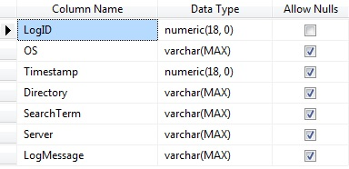
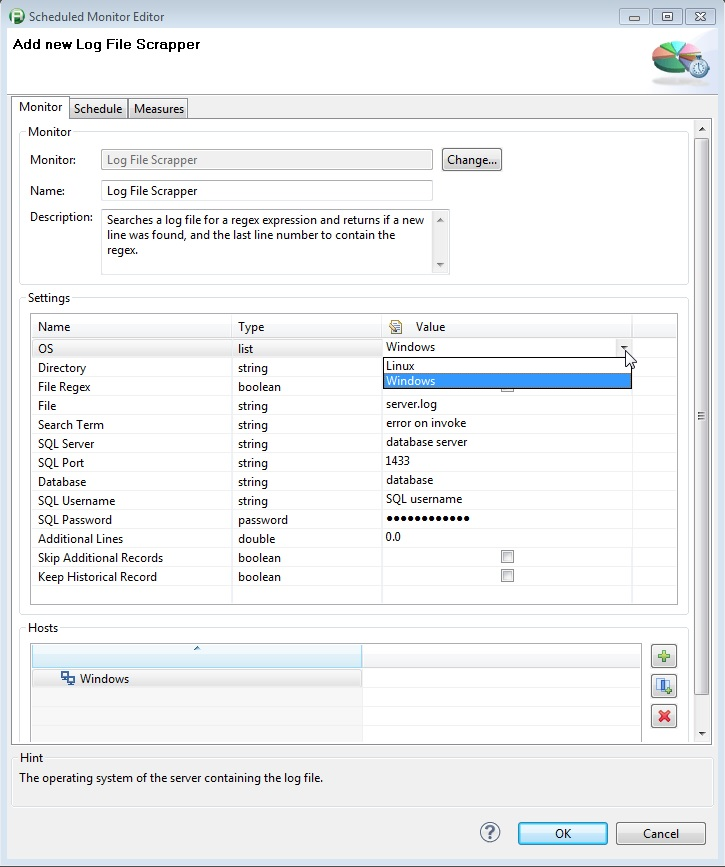
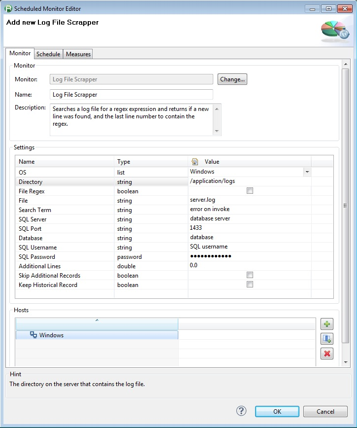

# Log File Monitor

## Overview

Previously called "Windows Log File Monitor" but updated to now support both Windows and Linux

The monitor searches a windows or Linux log file for text or regex expression and returns if a new line was found, and the last line number to contain the regex.

It stores the last result and position in the monitored file in a SQL database so that it knows where it ended the last time it ran so it's not reading the same lines over and over. If the log file
rolls over the monitor is smart enough to see that and starts from the beginning of the file again. The table in the database can be created by running the attached script or you can use the
screenshot from the Design view in the table to manually enter the values. The script will create the table on a database called dynaTracePluginDB. Change this name if you desire.

Monitor Properties

LogRecord Table Schema

Monitor Properties

LogFileMonitor Schema

Log File Monitor Measures

## Plugin Details

| Name | Log File Monitor
| :--- | :---
| Author | Derek Abing
| Supported Dynatrace Versions | >= 5.5
| License | [dynaTrace BSD](dynaTraceBSD.txt)
| Support | [Not Supported ](https://community.compuwareapm.com/community/display/DL/Support+Levels#SupportLevels-Community)  
| Release History |2013-03-12 Initial Release for Windows Log Files Only
| |2013-12-18 Log File Monitor for Windows and Linux
| Downloads | [Log File Monitor for Windows and Linux](com.logfile_3.14.15.jar)  
| |[Windows Log File Monitor 3.14.15](com.log.scrapper_3.14.15.jar)  
| |[SQL Command to create LogFileMonitor Table](LogFileMonitor.sql)  
| |[SQL Commands to create LogRecords Table](LogRecords.sql)

## Provided Measures

**Line Number**: The Line Number of the last known occurance of the specified search term.  
**New Message**: Returns a 1 if a new entry was made to log file with the search term specified.  
**Number of Messages**: The number of lines that matched the Search Term. 

## Configuration

| Name | Value
| :--- | :---
|OS |Dropdown for selecting either Windows or Linux
|Directory|The directory on the server that contains the log file.
|File Regex|If this is selected then the file must be specified in terms of a regex expression. If the directory contains multiple files that match the regex the newest file will be selected
|File|The File that you wish to search. If the File Regex option is checked, then this must be a regex.
|Search Term|A regex of what you wish to search for within the log file
|SQL Server|SQL Server to contain the repository of log file searches
|SQL Port|Port to connect to on the SQL Server
|Database|The database to use for the log file repository.
|SQL Username|Username used to connect to the SQL Database
|SQL Password|The password for the username used to connect to the SQL database
|Additional Lines|Amount of additional lines to include in file after the log message is found
|Skip Additional Records|If this box is checked, records included in the additional lines will be skipped for processing
|Keep Historical Record|If this box is checked, a historical record of each log message will be added to the LogRecords database. This database can then be queried for a list of all log messages matching a specific search and the corresponding timestamps

## Installation

Import the Plugin into the dynaTrace Server. For details how to do this please refer to the [dynaTrace documentation](https://community.compuwareapm.com/community/display/DOCDT50/Manage+and+Develop+User+Plugins).

